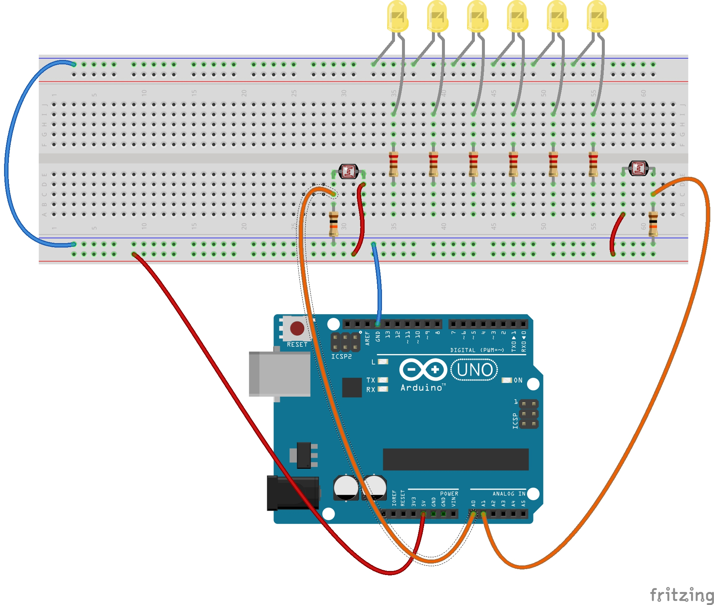

# Git Hub Template for Mechatronics and Digital Electronics
demo for class
   - remember there are some resources for GitHub on the [resources](https://github.com/loopstick/ResourcesForClasses/blob/master/README.md#github-resources) page.
   - [Markdown Cheat Sheet(https://github.com/adam-p/markdown-here/wiki/Markdown-Cheatsheet)
   

## Images
   - insert images in-line:
     - put images in an _images_ folder
     - use this syntax: ````  
   
     
   
   - images will show up at whatever size and orientation the original file is
   - re-size images before posting them if necessary
   
   
  
## Links
- link to videos or websites
  - I really liked this Arduino project: https://www.youtube.com/watch?v=_RyodnisVvU
    - ``I really liked this Arduino project: https://www.youtube.com/watch?v=_RyodnisVvU``
  - I really liked [this](https://www.youtube.com/watch?v=_RyodnisVvU) Arduino project. 
    - ``I really liked [this](https://www.youtube.com/watch?v=_RyodnisVvU) Arduino project.`` 


## GIF
- post a GIF to display the functionality of your circuit and code. [gifRocket](https://gifrocket.en.softonic.com/mac) works well on Mac  
       
   
- post a circuit diagram (hand-drawn or with [Fritzing](https://fritzing.org/home/))
    

     
- post code
  - see [Week 3](https://github.com/loopstick/GitHubDemo/tree/master/Week3) folder
    - zip Arduino folder for easy downloading
      - [Week 3 code: .zip](Week3/2LDR_DirectionSense_v4.zip) 
    - put unzipped code in the folder for online viewing
      - [Week 3 code: .ino](Week3/2LDR_DirectionSense_v4.ino)  
  - post inline:  
    - start with three backticks (`) and "cpp" to format code for C++
    - end with three backticks (`x3)
```cpp
/* 
  Code to sense direction of movement using 2 LDRs.
    written by Sudhu Tewari and Destinee Bailey for Interface Fall 2019
*/

unsigned long startCounter = 0;

const int  SensorPin = A1; //LEFT   
//const int ledPin = 9; 

//onst int  SensorPin2 = A3;  
const int  SensorPin2 = A2;   //RIGHT  
//const int ledPin2 = 11;     
 
int sensorState = 0;        
int lastSensorState = 0;     
int sensorRead = 0;
int trig = 0;
int trig1time = 0;

int sensorState2 = 0;        
int lastSensorState2 = 0;     
int sensorRead2 = 0;
int trig2 = 0;
int trig2time = 0;

long timedif = 0;
long lasttimedif = 0;
int dir = 0;

int thresh1 = 250;  //trigger threshold for sensor 1 - left  - Destinee's original val = 20
int thresh2 = 100;  //trigger threshold for sensor 2 - right - Destinee's original val = 20

//long now = 0;
//long interval = 1000;   // time to wait for second trigger
//long intervalTest = 0; 

const int led1 = 1; 
const int led2 = 2;
const int led3 = 3; 
const int led4 = 4;
const int led5 = 5;
const int led6 = 6;
const int led7 = 7;

int timer = 10;

void setup() 
{
  pinMode(SensorPin, INPUT);
  pinMode(SensorPin2, INPUT);
  //pinMode(led1, OUTPUT);
  //pinMode(led2, OUTPUT);
  pinMode(led3, OUTPUT);
  pinMode(led4, OUTPUT);
  pinMode(led5, OUTPUT);
  pinMode(led6, OUTPUT);
  pinMode(led7, OUTPUT);
  Serial.begin(9600);
}


void loop() 
{
  sensorRead = analogRead(SensorPin);
  sensorRead2 = analogRead(SensorPin2);
//  // Sensor debug ---------------  
//  Serial.print("sensor 1 (LEFT) = ");
//  Serial.print(sensorRead);
//  Serial.print("\t \t sensor 2 (RIGHT) = ");
//  Serial.println(sensorRead2);

  //  Adjustments for Dr. Sudhu's setup
  //    Sensor 1 LEFT   HIGH = 600  LOW = 30  THRESHOLD1 = 200
  //    Sensor 2 RIGHT  HIGH = 150  LOW = 10  THRESHOLD2 = 100

  if(sensorRead < thresh1)
  {
    sensorState = HIGH; //HIGH is when the sensor is triggered not when the sensor value is high
    //digitalWrite(led7, HIGH);
  }
  else{
    sensorState = LOW;
    //digitalWrite(led7, LOW);
  }
  
  if(sensorRead2 < thresh2)
  {
    sensorState2 = HIGH; //HIGH is when the sensor is triggered not when the sensor value is high
    //digitalWrite(led3, HIGH);
  }
  else
  {
    sensorState2 = LOW;
    //digitalWrite(led3, LOW);
  }
//======== sensor 1 ==========================================
  if (sensorState != lastSensorState) 
  {
    if (sensorState == HIGH) 
    {
      trig = HIGH;
      trig1time = millis();
      Serial.print("1 Triggered - ");
      trig1time = millis();
      Serial.println(trig1time); 
    }  
    //delay(5);  
  }
    lastSensorState = sensorState;
// ============================================================


// ======== sensor 2 ==========================================
    if (sensorState2 != lastSensorState2) 
  {
    //Serial.print("change detected on 2");
    if (sensorState2 == HIGH) 
    {
      trig2 = HIGH;
      trig2time = millis();
      Serial.print("\t 2 Triggered - ");
      Serial.println(trig2time);
    }  
    //delay(5);  
  }
    lastSensorState2 = sensorState2;
// ============================================================

// == Time Difference Calculation =============================
  timedif = trig1time - trig2time;

  if (timedif != lasttimedif){
      //    // Still something not quite right happening if only one sensor gets triggered
      //    
      //    Serial.print("lasttimedif: ");
      //    Serial.print(lasttimedif);
      //    Serial.print("\t \t \t timedif: " );
      //    Serial.println(timedif );

      // if time between triggers is too long: IGNORE
      if (abs(timedif) > 400) {
        timedif = 0;
        //dir = 0;
        //Serial.println("\t too long - timedif = 0");
      }
      
      if (timedif > 0){
      //moving to the LEFT! 
       Serial.print("\t\t\t <------");
       Serial.println("LEFT moving");
       dir = 1;  // use to set state for different led patterns or motor directions
      }

      if (timedif < 0){
      //moving to the RIGHT! 
       Serial.print("\t\t\t\t\t moving RIGHT");
       Serial.println("--------->");
       dir = 3;   // use to set state for different led patterns or motor directions
      }
    } else {
      //no change
    }
    
   lasttimedif = timedif;
   
// ============================================================

// = LEFT CODE ================================================

  if(dir == 1){
    // put left code here
      for (int thisPin = 3; thisPin < 8; thisPin++) {
        digitalWrite(thisPin, HIGH);
        delay(100);
        digitalWrite(thisPin, LOW);
    } 
    dir = 0; // resets dir so this code only runs once
  }

// ============================================================

// = RIGHT CODE ================================================

  if (dir == 3){
    for (int thisPin = 7; thisPin >= 3; thisPin--) {
      digitalWrite(thisPin, HIGH);
      delay(100);
      digitalWrite(thisPin, LOW);
    }
    dir = 0; // resets dir so this code only runs once
  }

// ============================================================


// = END VOID LOOP =====================================================
}  
// =========================================================
// =====================================================
// =================================================
// =============================================
// =========================================```


